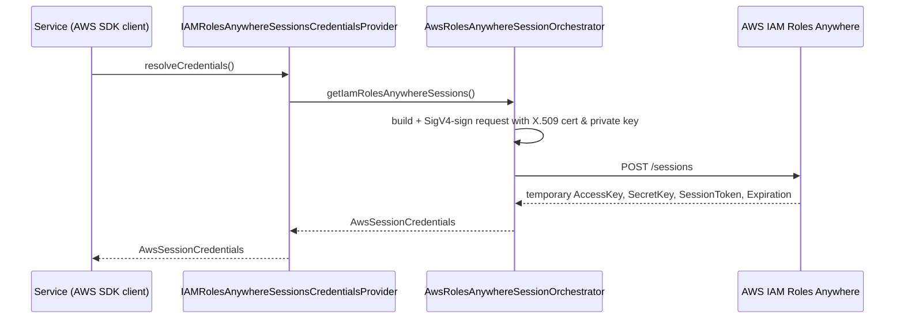

# How it works

This page describes how the starter turns an X.509 client certificate into temporary AWS credentials,
and how those credentials are kept fresh.

## Auto-configuration

`RolesAnywhereAutoConfiguration` is an `@AutoConfiguration` that is conditional on
`jeap.aws.rolesanywhere.enabled=true`. It runs `@AutoConfigureBefore(KafkaAutoConfiguration.class)` so
the credentials are available before Kafka beans are created. It declares two beans:

- `AwsRolesAnywhereSessionOrchestrator` — maps `AwsRolesAnywhereProperties` into a
  `RolesAnywhereAuthContext` (via `RolesAnywhereAuthContextMapper`) and performs the signed request.
  The `roleSessionName` defaults to the value of `spring.application.name` (or `default-session`).
- `AwsCredentialsProvider` (marked `@Primary`) — an `IAMRolesAnywhereSessionsCredentialsProvider`
  backed by the orchestrator. It is also published into a static
  `IAMRolesAnywhereCredentialsProviderHolder` so non-Spring code (for example Kafka client callbacks)
  can reach it.

## Credential exchange

The orchestrator builds and signs the IAM Roles Anywhere `CreateSession` (`POST /sessions`) request
itself, using AWS Signature Version 4 with the X.509 certificate — there is no dependency on the
external `aws_signing_helper` credential helper. The endpoint host is resolved from the configured
region. The HTTP call uses the JDK `UrlConnectionHttpClient`.

The response's first credential set yields an `AwsSessionCredentials` (access key, secret key, session
token and expiration time).

## Caching and refresh

`RolesAnywhereCredentialsProvider` (the abstract base) wraps the exchange in the AWS SDK
`CachedSupplier` with a `NonBlocking` prefetch strategy on a dedicated thread
(`iam-rolesanywhere-thread`). Credentials are:

- **prefetched** asynchronously about 5 minutes before expiry, and
- treated as **stale** about 1 minute before expiry.

This means callers normally get cached credentials without blocking, and a background refresh keeps
them valid. The provider prefetches once at construction so the first AWS call already has credentials.
Implementing `AutoCloseable`, it shuts the cache down when the context closes.

## Related

- [Getting started](getting-started.md)
- [Configuration reference](configuration.md)
- [Messaging integration](messaging-integration.md)
